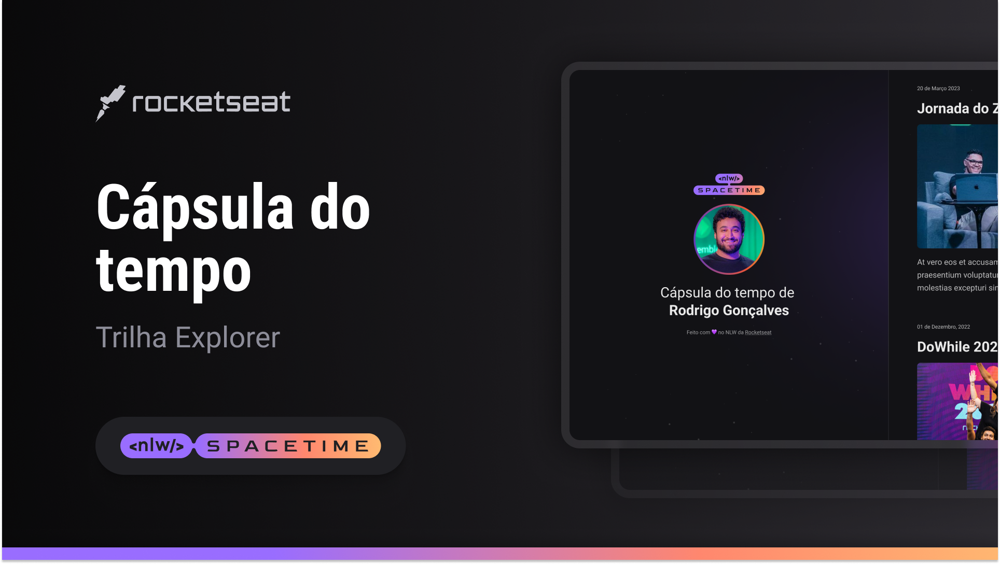

 

## Projeto
O Projeto Web Responsivo de uma cápsula do tempo para exibir memorias em uma linha do tempo.

## Tecnologias

Esse projeto foi desenvolvido durante o NLW da Rocketseat com as seguintes tecnologias:

-HTML
-CSS
-Git e GitHub

## Layout

Você pode visualizar o Layout do Projeto através
[desse link](https://www.figma.com/file/vebekbEHwzUnU9l9HTA5aS/Cápsula-do-tempo-•-Trilha-Explorer-(Community)?type=design&node-id=306-84&t=VUWH4RMWEFVB4CDm-0). 
É necessario ter uma conta no [Figma](https://www.figma.com)